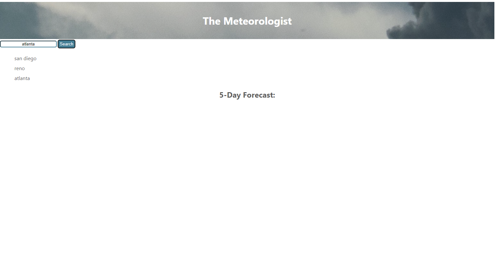

# weather-dashboard

site link: 
Repo link: https://github.com/sdoval27/weather-dashboard

## Description

- A site that displays the weather conditions in various cities. This includes the date, the weather conditions for today, and a five day forecast. When a city is searched, the previous searches are saved in the sidebar.

## Installation

N/A
 
## Usage
When opening the page, the website should appear as so:

 
## License
 
[MIT](https://choosealicense.com/licenses/mit/)

[def]: title-element.png